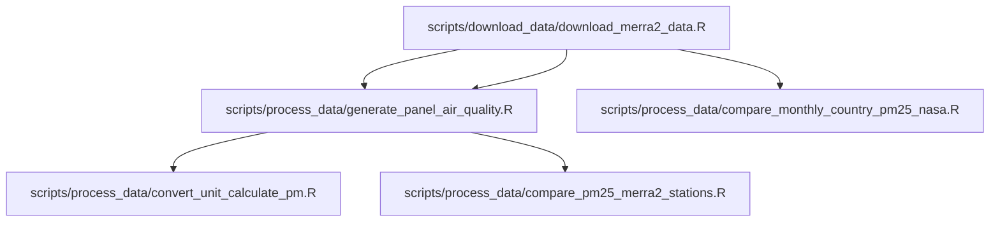

# IDB Project: Inequality in air pollution monitoring and exposure

**Objective:** This repository contains everything needed to reproduce our analysis in *“Inequality in Monitoring and Exposure to Air Pollution: Evidence from Four Latin American Cities”*. We measure how both monitoring coverage and pollutant exposure differ across socioeconomic groups in Bogotá, Mexico City, Santiago and São Paulo by integrating ground-station measurements and demographic indicators (also, we use MERRA-2 satellite data for robustness checks). To guarantee that every user—regardless of operating system or local setup—obtains bit-for-bit identical results, we:

- **Containerize** all system libraries and OS dependencies with [Docker](https://www.docker.com).  
- **Lock** R package versions and project settings with [renv](https://rstudio.github.io/renv/articles/renv.html).

Together, this ensures state-of ar-the-art reproducibility from data download through final figures.  

---

## Table of Contents

1. [Project Overview](#1-project-overview)
2. [Repository Structure](#2-repository-structure)
3. [Downloading Data](#3-downloading-data)
4. [Prerequisites](#4-prerequisites)
5. [Installation](#5-installation)
   - [Docker (Recommended)](#docker-recommended)
   - [Local Setup with renv](#local-setup-with-renv)
6. [Usage](#6-usage)
7. [Workflow](#7-workflow)
8. [Contributing](#8-contributing)
9. [License & Citation](#9-license--citation)
10. [Contact](#contact)

---

## 1. Project Overview

**Motivation:**  
Air pollution is the leading environmental health risk to physical health and can also affect many others dimensions of life. If exposure to air pollution is itself unequal it can further reinforce socioeconomic inequalities through the impacts on health, education, productivity and social mobility.

**Scope & Data:**

- **Cities:** Metropolitan areas of Bogotá (COL), Mexico City (MEX), Santiago (CHL) and São Paulo (BRA).  
- **Pollutants:** PM₂.₅ and PM₁₀ (primary focus), with supplemental analysis of O₃, CO and NO₂.  
- **Data Sources:**  
  - Hourly ground-station measurements (2023).  
  - Census microdata with residential location, education (all countries) and income (Brazil & Mexico).  
- **Harmonization:** Standardize education categories and align geographic boundaries to capture full metropolitan populations.

**Key Goals:**

1. Ingest and clean air quality and demographic data for each city.  
2. Merge pollution metrics with socioeconomic indicators to measure exposure disparities.  
3. Produce publication-quality figures, tables and statistical summaries of inequality patterns.  
4. Guarantee reproducibility through Docker (system dependencies) and renv (R package versions).

---

## 2. Repository Structure

```text
.
├── .dockerignore              # Files to ignore from Docker build
├── .gitignore                 # Files to ignore in Git
├── .Rprofile                  # RStudio project configuration (for renv)
├── Coding.Rproj               # RStudio project file
├── Dockerfile                 # Defines Docker environment
├── entrypoint.sh              # Launch script for container
├── renv/                      # Local package library managed by renv
├── renv.lock                  # Locked package versions
├── data/                      # Data directory 
│   ├── raw/                   # Original, unmodified data (shapefiles, .nc4, .csv)
│   ├── interim/               # Cleaned/aggregated data for further processing
│   └── processed/             # Cleaned/processed data ready for analysis
├── doc/                       # Documentation, references, methodology notes
├── src/                       # Utility functions & configs
│   ├── config_utils_download_data.R
│   ├── config_utils_plot_tables.R
│   └── config_utils_process_data.R
├── scripts/                   # “Glue” scripts that apply those utilities
│   ├── download_data/         # Scripts to pull in raw data
│   ├── process_data/          # Scripts to clean & transform data
│   └── tables_images/         # Scripts to generate tables & figures
├── results/                   # Output artifacts
│   ├── figures/               # Plots and visualizations
│   └── tables/                # Summary tables and CSV exports
├── fonts/                     # LaTeX‐style fonts for plots
├── LICENSE.md                 # Project license / terms of use 
└── README.md                  # Project overview and setup instructions

```

---

## 3. Downloading Data

Whenever possible, we fetch all project data via reproducible scripts. For datasets under restricted-access grants, we distribute files internally; for everything else, we reconstruct the site’s state (as of March 2025) using our download tools. Any open dataset that requires login is handled through the workflow below.

### Earthdata Credentials

### NASA Earthdata

Some data (e.g. MERRA-2) require free Earthdata credentials:

1. **Register** at [Earthdata Login](https://urs.earthdata.nasa.gov/users/new).  
2. **macOS / Linux**  
   - Create or update your `~/.netrc`:
    In your terminal, go to the location of the repo and write:

     ```bash
     cat <<EOF > ~/.netrc
     machine urs.earthdata.nasa.gov login YOUR_USER password YOUR_PASS
     EOF
     chmod 600 ~/.netrc
     ```

     where *YOUR_NASA_USER* and *YOUR_NASA_PASS* must be your saved username and password. The last part only is used in order to increase security of your information.

3. **Windows**  
   - Create (or update) `_netrc` in `%USERPROFILE%`:

     ```powershell
     @"
     machine urs.earthdata.nasa.gov login YOUR_USER password YOUR_PASS
     "@ | Out-File -Encoding ASCII $HOME\_netrc
     ```

   - In File Explorer, open **Properties → Security** on `_netrc` and grant only your user Read & Write.

4. **Exclude** your netrc file from Git (add `_netrc` / `.netrc` to `.gitignore`).

With credentials in place, simply run our [download script](src/download_data/run_download_merra2.R)—either in R or via Docker—to pull all MERRA-2 `.nc4` files automatically.

> **Tip:** You can always download manually from NASA’s [Data Portal](https://disc.gsfc.nasa.gov/datasets?project=MERRA-2), but scripting saves time and guarantees reproducibility.

---

## 4. Prerequisites

- **R (>= 4.2):** All required R packages and their exact versions are managed by `renv`. To install them, run:

  ```r
  renv::restore()
  ```

- **Docker:** A container runtime that captures system libraries, OS settings and dependencies in an isolated image.
  - Download & install from [Docker](https://www.docker.com/get-started):
    - **macOS** → Docker Desktop
    - **Windows** → Docker Desktop
    - **Linux** → Docker Engine\
      We recommend driving Docker from the terminal (CLI); running the full RStudio GUI inside a container can be resource-heavy.

- **System libraries:** Required for spatial and data processing. In our Dockerfile we install:

  ```bash
  libxml2-dev \
  libssl-dev \
  libcurl4-openssl-dev \
  libgdal-dev \
  libudunits2-dev \
  libpng-dev \
  libfreetype6-dev
  ```

- **Earthdata credentials:** For MERRA-2 and other protected sources, see **Section 3: Downloading Data**.

---

## 5. Installation

### Docker (Recommended)

1. **Build** the Docker image
   > **Note:** The initial build may take **30+ minutes**. Thanks to multi-stage caching, subsequent builds are much faster.

   ```bash
   docker build -t correiamarcos/air_monitoring:latest .
   ```

2. **Run** and mount your raw-data folder

   ```bash
   docker run --rm -it \
     -v "$(pwd)/data/raw:/air_monitoring/data/raw" \
     correiamarcos/air_monitoring:latest run \
       scripts/download_data/run_download_merra2.R \
       2023-01-01 2023-12-31 M2T1NXAER.5.12.4 data/raw/merra2
   ```

3. **Interactive shell** (for debugging or manual commands)

   ```bash
   docker run --rm -it correiamarcos/air_monitoring:latest bash
   ```

### Local Setup with renv

1. **Install** `renv` (if missing):

   ```r
   install.packages("renv")
   ```

2. **Restore** the exact package library:

   ```r
   renv::restore()
   ```

3. **Open** the RStudio project (`Coding.Rproj`) to start working locally.

---

## 6. Usage

- **Run a single script:**

  ```bash
  ./entrypoint.sh run scripts/process_data/clean_pollution_data.R
  ```

- **Generate all analyses and outputs:**

  ```bash
  ./entrypoint.sh run \
    scripts/config/setup.R \
    scripts/process_data/*.R \
    scripts/tables_images/*.R
  ```

- **Launch an interactive container shell** (advanced troubleshooting):

  ```bash
  docker run --rm -it correiamarcos/air_monitoring:latest bash
  ```

---

## 7. Workflow

Our project proceeds in four main stages:

1. **Data ingestion:**
   - For open datasets: run the `scripts/download_data/` scripts; raw files appear in `data/raw/`.
   - For restricted-access files: these are distributed internally.
2. **Preprocessing:**
   - Scripts in `scripts/process_data/` clean, transform and merge the raw data.
3. **Analysis & Visualization:**
   - Scripts in `scripts/tables_images/` produce publication-quality figures in `results/figures/` and tables in `results/tables/`.
4. **Review & Export:**
   - Retrieve the final outputs for manuscript drafting or policy briefs.

We also provide a visualization of scripts dependencies as following:

### 1. Processing Data



### 2. Generating Images

To be created.

---

## 8. Contributing

1. Fork the repository.
2. Create a feature branch: `git checkout -b feature/your-feature`.
3. Commit changes with descriptive messages.
4. Push and open a Pull Request.
5. Ensure code style consistency and add tests if applicable.

---

## 9. License & Citation

- Licensed under MIT License. See [LICENSE.md](LICENSE.md).
- Please cite this repository or related publications when reusing methods or results.

---

## Contact

- **Project Lead:** Bridget Hoffmann
- **Affiliation:** Inter‑American Development Bank
- **Email:** [bridgeth@iadb.org][bridget_email]

**Last Updated:** 2025‑05‑14 (YYYY-MM-DD)

[bridget_email]: bridgeth@iadb.org
