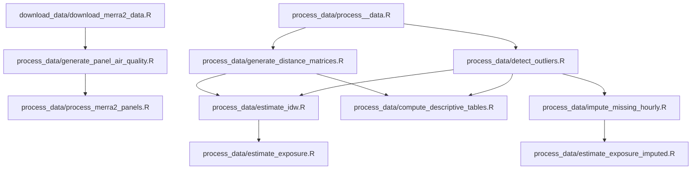

# IDB Project: Inequality in Air Pollution Monitoring and Exposure

**Objective:** This repository contains the complete replication package for *“Inequality in Air Pollution Monitoring and Exposure: Evidence from Four Latin American Cities”*.

We measure how both monitoring coverage and pollutant exposure differ across socioeconomic groups in Bogotá, Mexico City, Santiago, and São Paulo. To support computational reproduction across environments, this project uses the following controls. Their success must be assessed with a recorded run; they do not guarantee identical results:
1.  **Containerized** using [Docker](https://www.docker.com) to lock system libraries (GDAL, GEOS, R).
2.  **Version-controlled** using [renv](https://rstudio.github.io/renv/) to lock R package versions.

Together, this ensures state-of-the-art reproducibility from data download through final figures.

---

## Table of Contents

1. [Project Overview](#1-project-overview)
2. [Repository Structure](#2-repository-structure)
3. [Downloading Data](#3-downloading-data)
4. [Prerequisites](#4-prerequisites)
5. [Installation](#5-installation)
6. [Usage](#6-usage)
7. [Workflow](#7-workflow)
8. [Contributing](#8-contributing)
9. [License & Citation](#9-license--citation)

> **New here?** [doc/HOW_TO_RUN.md](doc/HOW_TO_RUN.md) is a step-by-step guide written
> for students and reviewers: install the container, understand the layout, and
> reproduce the paper's figures and tables.

---

## 1. Project Overview

**Motivation:**
Air pollution is a leading environmental health risk. If exposure to pollution is unequal, it reinforces socioeconomic disparities in health, education, and productivity.

**Scope:**
- **Cities:** Bogotá (COL), Mexico City (MEX), Santiago (CHL), São Paulo (BRA).
- **Pollutants:** PM₂.₅ and PM₁₀ (primary), plus O₃, CO, NO₂.
- **Data:**
    - Ground-station measurements (hourly, 2023).
    - Census microdata (Income, Education, Location).
    - MERRA-2 Satellite Aerosol Optical Depth (for robustness).

---

## 2. Repository Structure

This project follows a "Source vs. Execution" pattern. `src/` contains logic/functions, while `scripts/` executes that logic.

```text
.
├── Makefile                   # Stage-level wrapper (skip-unchanged rebuilds)
├── docker-compose.yml         # Dev Orchestration
├── docker-compose.release.yml # Replication Orchestration (Immutable)
├── Dockerfile                 # Image definition
├── entrypoint.sh              # Container entry point (batch runner / RStudio)
├── .env.example               # Template for credentials (COPY TO .env)
├── renv.lock                  # Exact R package versions
├── src/                       # Source Code (Functions only; no side effects)
│   ├── city_specific/         # Cleaning logic per city + registry.R
│   └── general_utilities/
│       ├── base_utils.R       # Shared helpers, no packages, no side effects
│       ├── setup_packages.R   # ensure_installed() / attach_packages()
│       ├── theme_paper.R      # set_paper_theme()
│       ├── config_utils_*.R   # One thin loader per stage: packages + source() its parts
│       ├── process/           # raw -> interim -> processed logic
│       ├── plot/              # figure and LaTeX-table builders
│       └── validation/        # legacy-comparison helpers
├── scripts/                   # Execution Pipelines
│   ├── download_data/         # Pull raw data from APIs
│   ├── process_data/          # Clean & Transform (Raw -> Interim -> Processed)
│   ├── tables_images/         # Generate final outputs
│   ├── validation_old_version/ # Legacy comparison track
│   └── run_pipeline.R         # Master orchestrator; Makefile declares stage dependencies
├── data/                      # (git-ignored)
│   ├── downloads/             # Raw pulls, as fetched
│   ├── raw/                   # Immutable original inputs
│   ├── interim/               # Intermediate steps (parquet/rds)
│   ├── processed/             # Final analysis-ready datasets
│   └── _legacy/               # Coauthor's original data (validation track only)
├── results/
│   ├── figures/               # Canonical figures in seven topic folders
│   └── tables/                # Canonical tables, flat (LaTeX and CSV)
├── tests/                     # testthat suite (Rscript tests/testthat.R)
└── doc/                       # Guides, audit trail, remaining-work notes
```

---

## 3. Downloading Data

Whenever possible, we fetch all project data via reproducible scripts. For datasets under restricted-access grants, we distribute files internally; for everything else, we reconstruct the site’s state (as of March 2025) using our download tools. Any open dataset that requires login is handled through the workflow below.

### NASA Earthdata

Some data (e.g. MERRA-2) require free Earthdata credentials:

1. **Register** at [Earthdata Login](https://urs.earthdata.nasa.gov/users/new).  
2. **macOS / Linux**  
   - Create or update your `~/.netrc`:
    In your terminal, go to the location of the repo and write:

     ```bash
     cat <<EOF > ~/.netrc
     machine urs.earthdata.nasa.gov login YOUR_USER password YOUR_PASS
     EOF
     chmod 600 ~/.netrc
     ```

     where *YOUR_NASA_USER* and *YOUR_NASA_PASS* must be your saved username and password. The last part only is used in order to increase security of your information.

3. **Windows**  
   - Create (or update) `_netrc` in `%USERPROFILE%`:

     ```powershell
     @"
     machine urs.earthdata.nasa.gov login YOUR_USER password YOUR_PASS
     "@ | Out-File -Encoding ASCII $HOME\_netrc
     ```

   - In File Explorer, open **Properties → Security** on `_netrc` and grant only your user Read & Write.

4. **Exclude** your netrc file from Git (add `_netrc` / `.netrc` to `.gitignore`).

With credentials in place, simply run our [download script](scripts/download_data/download_merra2_data.R)—either in R or via Docker—to pull all MERRA-2 `.nc4` files automatically.

> **Tip:** You can always download manually from NASA’s [Data Portal](https://disc.gsfc.nasa.gov/datasets?project=MERRA-2), but scripting saves time and records the acquisition procedure.

---

## 4. Prerequisites

- **R 4.6** (the version pinned by the Docker image and `renv.lock`): All required R
  packages and their exact versions are managed by `renv`. To install them, run:

  ```r
  renv::restore()
  ```

- **Docker:** A container runtime that captures system libraries, OS settings and dependencies in an isolated image.
  - Download & install from [Docker](https://www.docker.com/get-started):
    - **macOS** → Docker Desktop
    - **Windows** → Docker Desktop
    - **Linux** → Docker Engine\
      We recommend driving Docker from the terminal (CLI); running the full RStudio GUI inside a container can be resource-heavy.

- **System libraries:** Required for spatial and data processing. In our Dockerfile we install:

  ```bash
  libxml2-dev \
  libssl-dev \
  libcurl4-openssl-dev \
  libgdal-dev \
  libudunits2-dev \
  libpng-dev \
  libfreetype6-dev
  ```

- **Earthdata credentials:** For MERRA-2 and other protected sources, see **Section 3: Downloading Data**.

---

## 5. Installation

### Docker (Recommended)

There is no image to pull from a registry — `docker compose up` builds it locally
from the `Dockerfile` and starts it.

1. **Configure** your environment (RStudio login, credentials if re-downloading):

   ```bash
   cp .env.example .env    # defaults work for replication
   ```

2. **Build and start** the containers:
   > **Note:** The initial build may take **30+ minutes**. Thanks to multi-stage
   > caching, subsequent builds are much faster.

   ```bash
   docker compose up
   ```

   This starts the `analysis` service (R + RStudio + the pinned package library) and
   a `selenium` service (only used by the download scripts).

3. **Open RStudio** at `http://localhost:8787` (user/password from `.env`;
   defaults `rstudio` / `replication`). `src/`, `scripts/` and `results/` are mounted
   live from your clone.

4. **Interactive shell** (for debugging or manual commands)

   ```bash
   docker compose run --rm analysis bash
   ```

For the immutable replication run — code baked into the image, `data/raw` mounted
read-only — use `docker compose -f docker-compose.release.yml up` instead.

### Local Setup with renv

1. **Install** `renv` (if missing):

   ```r
   install.packages("renv")
   ```

2. **Restore** the exact package library:

   ```r
   renv::restore()
   ```

3. **Open** the RStudio project (`Coding.Rproj`) to start working locally.

---

## 6. Usage

- **Generate all analyses and outputs** — the master orchestrator is the single
  record of run order (order matters, so use it rather than a glob). In RStudio:

  ```r
  source(here::here("scripts", "run_pipeline.R"))
  ```

- **Or use the Makefile** (stage-level wrapper with skip-unchanged rebuilds; stamps
  under `data/.make`):

  ```bash
  make              # process -> distances -> outliers -> exposure -> figures + tables
  make help         # list all stage targets
  make DOCKER=1     # run every recipe inside the compose "analysis" service
  ```

  `make download` (credential-gated raw pulls) and `make merra2` (the satellite
  track) are deliberately **not** part of `make all`.

- **Run a single script** (from the host, inside the container):

  ```bash
  docker compose run --rm analysis Rscript scripts/process_data/detect_outliers.R
  ```

  Or open it in RStudio and source it — every script is self-contained via
  `here::here()`.

- **Launch an interactive container shell** (advanced troubleshooting):

  ```bash
  docker compose run --rm analysis bash
  ```

See [doc/HOW_TO_RUN.md](doc/HOW_TO_RUN.md) for the full walkthrough, including the
reviewer's path to the manuscript's own figures and tables through `config/paper_artifacts.csv`.

---

## 7. Workflow

Our project proceeds in four main stages:

1. **Data ingestion:**
   - For open datasets: run the `scripts/download_data/` scripts; source downloads remain in `data/downloads/` or `data/raw/`; derived products go to `data/interim/`.
   - For restricted-access files: obtain authorized access from the data owner; redistribution is not assumed.
2. **Preprocessing:**
   - Scripts in `scripts/process_data/` clean, transform and merge the raw data
     (`data/raw/` → `data/interim/` → `data/processed/`, with inspectable Parquet
     checkpoints at each step).
3. **Analysis & Visualization:**
   - Scripts in `scripts/tables_images/` produce the paper's figures and tables in
     `results/figures/` (seven topic folders) and flat `results/tables/`. The tracked
     `config/paper_artifacts.csv` selects artifacts for export to existing manuscript paths.
4. **Review & Export:**
   - Retrieve the final outputs for manuscript drafting or policy briefs.

We also provide a visualization of scripts dependencies as following (simplified —
the `Makefile` and `scripts/run_pipeline.R` are the authoritative stage lists):

### 1. Processing Data


```mermaid
flowchart TD
  DL["download_data/download_merra2_data.R"]
  GP["process_data/generate_panel_air_quality.R"]
  MP["process_data/process_merra2_panels.R"]
  PC["process_data/process_<city>_data.R"]
  GD["process_data/generate_distance_matrices.R"]
  DO["process_data/detect_outliers.R"]
  IDW["process_data/estimate_idw.R"]
  REG["process_data/estimate_exposure.R"]
  DESC["process_data/compute_descriptive_tables.R"]
  IMH["process_data/impute_missing_hourly.R"]
  EEI["process_data/estimate_exposure_imputed.R"]

  DL --> GP --> MP
  PC --> GD --> IDW --> REG
  PC --> DO --> IDW
  GD --> DESC
  DO --> DESC
  DO --> IMH --> EEI
```

### 2. Generating Images


```mermaid
flowchart TD
  MP["process_data/process_merra2_panels.R"]
  REG["process_data/estimate_exposure.R"]
  EEI["process_data/estimate_exposure_imputed.R"]
  IDW["process_data/estimate_idw.R"]
  IMH["process_data/impute_missing_hourly.R"]
  DESC["process_data/compute_descriptive_tables.R"]

  MP --> FM["tables_images/figure_merra2_vs_stations.R"]
  MP --> FA["tables_images/figure_aerosol_composition.R"]
  REG --> GE["tables_images/generate_exposure_plots.R"]
  EEI --> GE
  IDW --> FK["tables_images/figure_quintile_kernel_distributions.R"]
  IMH --> FD["tables_images/figure_imputation_diagnostics.R"]
  DESC --> ST["tables_images/render_station_tables.R"]
  DESC --> CT["tables_images/render_census_tables.R"]
```

`figure_study_area_maps.R` reads prepared `data/interim/geospatial_data/` files, so it has no
processing prerequisite; `figure_stations_on_metro_area.R` additionally reads station
locations from `data/interim/`.

---

## 8. Contributing

1. Fork the repository.
2. Create a feature branch: `git checkout -b feature/your-feature`.
3. Commit changes with descriptive messages.
4. Push and open a Pull Request.
5. Ensure code style consistency and add tests if applicable.

---

## 9. License & Citation

- Licensed under MIT License. See [LICENSE.md](LICENSE.md).
- Please cite this repository or related publications when reusing methods or results.

---

## Contact

- **Project Lead:** Bridget Hoffmann
- **Affiliation:** Inter‑American Development Bank
- **Email:** [bridgeth@iadb.org][bridget_email]

**Last Updated:** 2026‑08‑31 (YYYY-MM-DD)

[bridget_email]: bridgeth@iadb.org

For the current verification modes, isolated-run protocol and manuscript export, see [HOW_TO_RUN](doc/HOW_TO_RUN.md). Shared agent guidance is in [doc/ai](doc/ai/README.md). Historical outputs are not a revision-matched numerical baseline.
