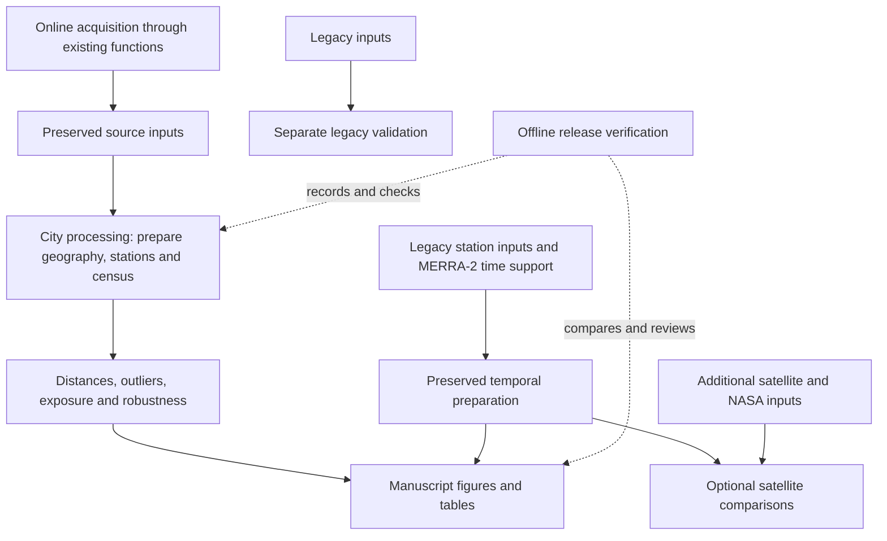

# Inequality in Air Pollution Monitoring and Exposure

Replication repository for *Inequality in Air Pollution Monitoring and Exposure:
Evidence from Four Latin American Cities*. It analyzes monitoring coverage and pollutant
exposure across Bogotá, Mexico City, Santiago, and São Paulo.

## Current status

The repository records a reproducible workflow; it does not yet establish complete
scientific reproduction. That claim requires declared source inputs, a fresh isolated run,
revision-matched numerical comparisons, and review of plot data and rendering. Historical
outputs are not a reviewed baseline. See [doc/HOW_TO_RUN.md](doc/HOW_TO_RUN.md) for the
current procedure and limitations.

Choose a route:

| Goal | Start here |
|---|---|
| Find documentation by audience or topic | [Documentation index](doc/README.md) |
| Learn the repository as a student | [First run](doc/guides/first-run.md) |
| Contribute changes | [Contributor guide](doc/guides/contributing.md) |
| Assess repository evidence and limitations | [Current review](doc/REPO_REVIEW.md), [review catalog](doc/reviews/README.md) |
| Study resolution sensitivity | [Supporting analysis guide](doc/RESOLUTION_SENSITIVITY.md) |
| Reproduce manuscript outputs | [Run and verify](doc/HOW_TO_RUN.md#manuscript-pipeline) |
| Run optional satellite comparisons | [Supporting analyses](doc/HOW_TO_RUN.md#supporting-analyses) |
| Develop or acquire inputs | [Development and acquisition](doc/HOW_TO_RUN.md#development-and-acquisition) |
| Record an isolated release check | [Isolated batch verification](doc/HOW_TO_RUN.md#isolated-batch-verification) |

## Repository layout

```text
src/                 Reusable R functions
scripts/             Executable acquisition, processing, figures, validation and verification
data/downloads/      Preserved acquired source files (ignored; inputs of record)
data/raw/            Authorized original inputs (ignored; inputs of record)
data/interim/        Regenerated intermediate data, including prepared geography
data/processed/      Regenerated analytical products
results/             Regenerated figures and tables
config/paper_artifacts.csv  Manuscript artifact paths and producing scripts
doc/HOW_TO_RUN.md    Operational instructions and reproduction limits
doc/ai/              Shared guidance for coding assistants
tools/harness/       Optional Claude/Codex development-tooling policy
```

`src/` contains reusable logic; `scripts/` runs it. The stage lists in
`scripts/run_pipeline.R` and the `Makefile` are maintained together.

## Inputs and geography

External acquisition is a separate, online step. Keep authorized downloads and provider
responses under `data/downloads/`, with their requested year/version, retrieval date and
checksum. City processing then prepares the geographic layers it needs from those local
sources, with downloads disabled. A missing source must be acquired through the relevant
download script; a pre-existing generated layer is not a substitute for preparation.

The isolated verifier mounts `data/raw/`, `data/downloads/`, and `data/_legacy/` read-only
and disables runtime networking. This tests whether declared local inputs are sufficient;
it does not acquire data. Some sources have access restrictions or changing providers, so
availability and redistribution rights remain separate requirements.

MERRA-2 acquisition requires NASA Earthdata access. Configure credentials outside the
repository and follow the acquisition guidance in [doc/HOW_TO_RUN.md](doc/HOW_TO_RUN.md).
Do not commit credentials or source inputs.

## Containers

Three Compose files serve distinct uses:

| Command | Use |
|---|---|
| `docker compose up` | Interactive RStudio with live project code for development. |
| `docker compose --profile acquisition up` | Development plus Selenium for acquisition scripts that need a browser. |
| `docker compose -f docker-compose.release.yml up` | Interactive RStudio using code baked into the image, with source inputs read-only. |
| `Rscript scripts/verification/verify.R --full` | Batch-only isolated verification with fresh derived outputs and no runtime network. |

Copy `.env.example` to `.env` only for interactive RStudio settings. The verification
container uses neither credentials nor Selenium. `renv.lock` controls R packages; image
identity, code revision, lockfile hash, installed versions, and source inventories provide
the environment evidence. There is no active dated package-repository setting.

## Manuscript pipeline

After authorized inputs have been acquired, run either entry point from the repository root:

```sh
make all
# or, in R:
source(here::here("scripts", "run_pipeline.R"))
```

Both routes run city processing, the core analysis, the preserved temporal preparation, and
manuscript figures and tables. The temporal figures retain their existing legacy station
samples and MERRA-2 timestamp support.

`make merra2` runs additional optional satellite comparisons after `make all` prerequisites
and any extra satellite/NASA inputs are available. It is supporting analysis, not a separate
manuscript route.


```mermaid
flowchart TD
  D[Online acquisition through existing functions] --> I[Preserved source inputs]
  I --> P[City processing: prepare geography, stations and census]
  P --> A[Distances, outliers, exposure and robustness]
  A --> F[Manuscript figures and tables]
  T[Legacy station inputs and MERRA-2 time support] --> H[Preserved temporal preparation]
  H --> F
  H --> S[Optional satellite comparisons]
  N[Additional satellite and NASA inputs] --> S
  L[Legacy inputs] --> V[Separate legacy validation]
  B[Offline release verification] -. records and checks .-> P
  B -. compares and reviews .-> F
```

## Checks and export

```sh
Rscript tests/testthat.R --mode=synthetic
Rscript scripts/verification/verify.R
Rscript scripts/verification/verify.R --full
```

Passing tests or a completed run are evidence for the checks that actually ran; they do not
by themselves establish scientific or independent reproduction. The verifier records inputs,
outputs, environment details, failures, and comparison limitations. Export selected artifacts
with `scripts/export/export_paper.R`; see the operational guide for commands and constraints.

## Contributing and citation

Keep scientific specifications and inputs of record unchanged unless explicitly authorized.
Use the shared guidance in [doc/ai](doc/ai/README.md) for assistant-supported work. The project
is released under the [MIT License](LICENSE.md); cite the repository and related publication
when reusing its methods or results.

Contact: Bridget Hoffmann, Inter-American Development Bank,
[bridgeth@iadb.org](mailto:bridgeth@iadb.org).
